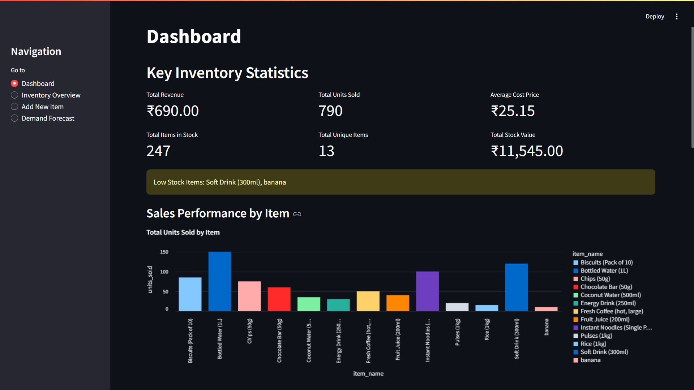
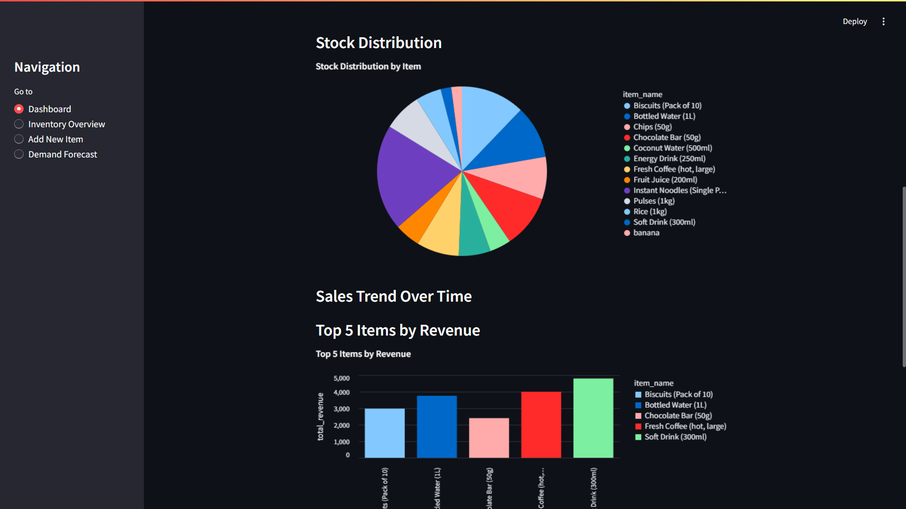
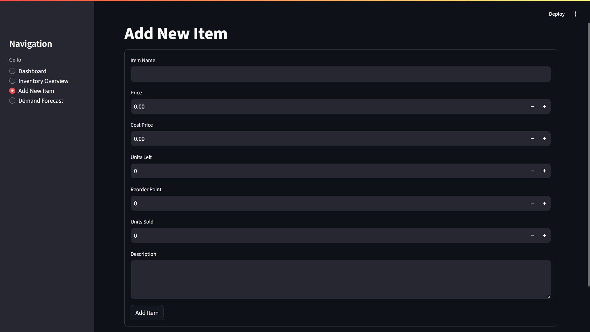
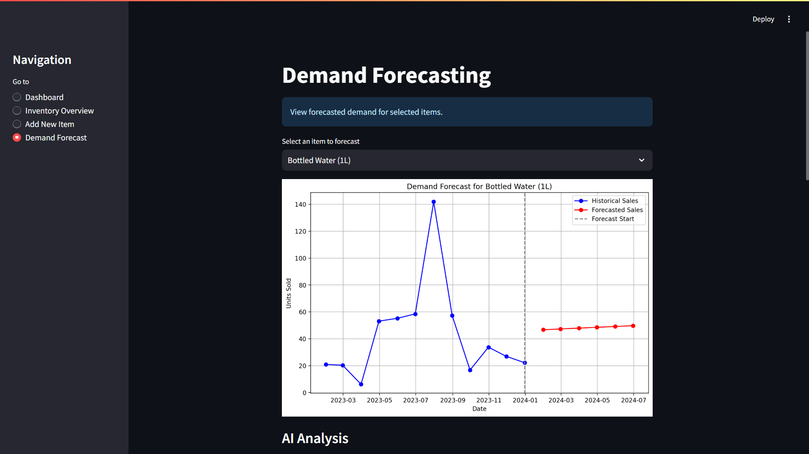

# 🏢 Dhanda Management

Welcome to **Dhanda Management** – a comprehensive inventory management platform designed to simplify tracking, forecasting, and managing stock levels. Dhanda Management aims to help businesses stay on top of their inventory by providing insightful analytics and easy-to-use features for day-to-day operations.

---

## 🌟 Features

- **Dashboard Overview:** 📊 Get a quick glance at key inventory metrics, including total revenue, stock levels, and best-selling items.
- **Inventory Management:** 📦 Add, edit, and manage product information, including price, stock, reorder points, and descriptions.
- **Demand Forecasting:** 📈 Predict future demand using time series analysis, helping to maintain optimal stock levels.
- **Stock Alerts:** 🚨 Receive notifications when items are running low, ensuring you never run out of essential products.
- **Sales Analytics:** 📉 Analyze sales trends and view top-selling products to optimize your inventory strategy.
- **Custom Reports:** 📑 Generate custom reports on inventory performance, stock levels, and financial metrics.

---

## 🚀 Tech Stack

- **Frontend:** Streamlit
- **Backend:** Python (Flask), Streamlit
- **Database:** MongoDB
- **Analytics:** NumPy, Pandas, Statsmodels, Scikit-learn
- **Visualization:** Altair, Matplotlib

---

## 📋 Modules Overview

1. **Dashboard** – View key metrics and visualize sales trends over time.
2. **Inventory Overview** – Add new items, track stock levels, and monitor reorder points.
3. **Add New Item** – Add product details such as name, price, units sold, reorder points, and description.
4. **Demand Forecast** – View forecasted sales using advanced time series analysis.
5. **Sales Analytics** – Analyze sales performance to identify top products and areas for improvement.

---

## 🔍 AI Features

- **Demand Forecasting Analysis:** 🧠 Leverage machine learning algorithms for accurate sales forecasting.
- **Automated Alerts:** ⚡ Get notified when stock is below the reorder level to prevent inventory shortages.
- **Sales Pattern Analysis:** 🔎 Identify trends and seasonality to make data-driven inventory decisions.

---

## 📸 Screenshots

### 1️⃣ Dashboard


### 2️⃣ Inventory Overview


### 3️⃣ Add New Item


### 4️⃣ Demand Forecast


### 5️⃣ Demand Forecast


---

## 📜 **Credits**  
- **Developers**: [@Shubham_Bendre](https://github.com/Shubham-Bendre), [@Malhar_Singh](https://github.com/Malhar2400), [@Yash_Chougule](https://github.com/YxASH), [@Suyog_Sable](https://github.com/Suyog_Sable)  
- **Special Thanks**: To all the mentors and community for their support! 🎉
  
---

## 🛠️ Installation

1. **Clone the repository:**  
   ```bash
   git clone https://github.com/Interloopers/Dhanda-Management.git
